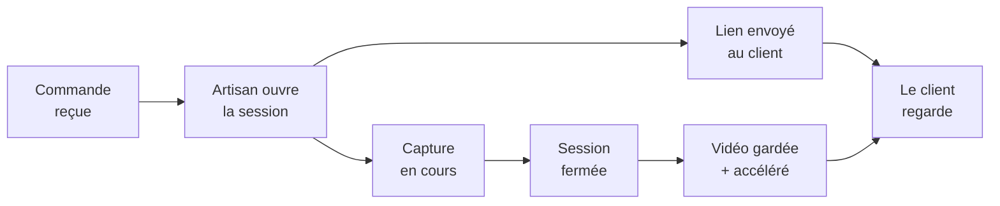

# Le direct de l'atelier, brief produit

22 sept. 2026 · Charly

## Le problème et la promesse

Quand un client commande un objet fabriqué sur mesure, il paie, puis il attend sans rien voir. Le direct de
l'atelier remplace cette attente par un spectacle : le flux vidéo de sa commande en train d'être fabriquée.

Ce n'est pas un configurateur, ce n'est pas du suivi de commande avec des étapes qui s'allument. C'est du
partage de vidéo, en direct ou en différé, de la main ou de la machine au travail.

Ce que l'artisan y gagne, dans l'ordre d'importance :

- **Il justifie son prix.** Voir trois heures de tournage à la main rend un bol à 60 € évident.
- **Il occupe le délai.** Le client qui regarde n'écrit pas pour demander où en est sa commande.
- **Il produit du contenu sans effort.** Chaque commande filmée devient une vidéo réutilisable.

Ce que le client y gagne : la preuve que son objet est unique, et quelque chose à montrer autour de lui.

## Pour qui

L'impression 3D est le terrain de départ parce que c'est le mien, mais c'est le plus mauvais cas d'usage du
lot : une machine qui bouge lentement derrière une vitre. Les métiers où l'on voit des mains valent bien mieux.

| Métier | Ce qu'on filme | Durée typique | Intérêt à regarder |
| --- | --- | --- | --- |
| Poterie, céramique | Les mains au tour | 20 à 40 min | Très fort |
| Pâtisserie sur mesure | Le montage et le décor | 1 à 3 h | Très fort |
| Broderie, couture | La machine et les finitions | 30 min à 2 h | Fort |
| Bijouterie | L'établi, le soudage | 1 à 4 h | Fort |
| Gravure laser | La tête qui trace le motif | 5 à 30 min | Moyen |
| Impression 3D | Le plateau, couche par couche | 2 à 20 h | Faible en direct, fort en accéléré |

Deux enseignements tirés de ce tableau. D'abord, la durée de fabrication commande le format : sous une heure
le direct a du sens, au-delà c'est l'accéléré qui est regardé. Ensuite, le premier client cible n'est pas un
imprimeur 3D, c'est un potier ou un pâtissier.

Côté client final, la cible est celle qui commande un objet à forte charge affective : cadeau, mariage,
naissance, pièce à son nom. Personne ne regarde la fabrication d'une pièce technique de rechange.

## Le parcours

Le produit tient en une boucle courte : l'artisan ouvre une session, le client reçoit un lien, la session se
ferme et laisse une vidéo.

Côté artisan, tout doit tenir en trois gestes, sans ordinateur. Il ouvre l'application sur son téléphone,
choisit la commande concernée, pose le téléphone sur un trépied et appuie sur démarrer. Il ne touche plus à
rien jusqu'à la fin.

Côté client, aucune installation. Il reçoit un lien par message, l'ouvre dans son navigateur, et voit soit le
direct si la session est en cours, soit l'accéléré si elle est terminée. Le lien reste valable après la
livraison, c'est ce qui le rend partageable.

Le point de friction à surveiller : l'artisan qui oublie de lancer la session. Si le produit dépend d'un geste
volontaire à chaque commande, il sera abandonné en trois semaines. D'où l'intérêt, plus tard, d'un démarrage
automatique dès qu'une impression démarre ou qu'une commande passe en fabrication.

## Le périmètre de la première version

La V1 fait une seule chose : transformer un téléphone posé sur un trépied en lien partageable. Tout le reste
attend.

Ce qu'elle fait :

- L'artisan crée une session depuis son téléphone, avec un nom de commande et un nom de client.
- Le téléphone diffuse, écran verrouillé si possible, sans surchauffer au bout de vingt minutes.
- Un lien public non devinable donne accès à la page de visionnage.
- À la fin, la vidéo est conservée et un accéléré est généré automatiquement.
- Le client peut télécharger l'accéléré.

Ce qu'elle ne fait pas, volontairement :

- Pas de compte client, pas de mot de passe. Le lien fait office de clé.
- Pas de son. Il n'apporte rien et il crée un problème juridique dès qu'une conversation passe dans le micro.
- Pas de chat, pas de commentaire, pas de notification au client.
- Pas d'application native. Une page web installée sur l'écran d'accueil suffit et évite les magasins
  d'applications.
- Pas de facturation, pas d'abonnement, pas de marque blanche.
- Pas de branchement sur les imprimantes 3D. Le téléphone d'abord, la caméra de machine ensuite.

Cette dernière ligne est le choix structurant : viser le téléphone plutôt que le matériel dédié ouvre le
produit à tous les métiers, et supprime la question du boîtier, du coût unitaire et de la logistique.

## L'architecture technique

La vraie question n'est pas le langage, c'est le mode de diffusion. Trois options, et le choix se joue sur la
latence contre le coût.

| Option | Latence | Coût de diffusion | Complexité | Verdict |
| --- | --- | --- | --- | --- |
| WebRTC direct | Moins d'1 s | Serveur TURN à prévoir | Élevée | Surdimensionné |
| HLS via un service de streaming | 10 à 30 s | Facturation à la minute et au Go | Faible | Recommandé |
| Photos toutes les 2 s | 2 à 5 s | Négligeable | Très faible | Suffisant pour le prototype |

La latence n'a aucune importance ici. Personne ne dialogue avec le potier, le client regarde. Trente secondes
de retard ne se perçoivent pas. Donc WebRTC est à écarter, malgré son attrait apparent.

L'architecture recommandée pour la V1 :

- **Capture** : page web sur le téléphone de l'artisan, avec getUserMedia et MediaRecorder, qui pousse des
  segments vers le serveur. Pas d'application à installer.
- **Diffusion** : un service de streaming tiers qui ingère en RTMP ou WebRTC et ressort du HLS. Mux,
  Cloudflare Stream ou équivalent. On n'héberge pas de serveur vidéo.
- **Application** : Next.js sur Vercel, Supabase pour les sessions et les liens, comme tes autres projets.
  Rien de nouveau à apprendre.
- **Accéléré** : généré côté service de streaming à la fin de la session, ou par une tâche ffmpeg si le
  service ne le fait pas.

Le piège à anticiper : un téléphone qui diffuse pendant trois heures chauffe, vide sa batterie et voit l'écran
s'éteindre. Il faut donc une alimentation branchée, une résolution limitée à 720p, et une reprise automatique
si la session se coupe. C'est là que se joue la qualité perçue du produit, bien plus que dans la latence.

## Le prototype à monter en premier

Objectif du prototype : répondre à une seule question, est-ce qu'un client regarde vraiment. Pas construire le
produit.

Version la plus bête qui marche, une journée de travail :

1. Une page de capture qui prend une photo toutes les deux secondes depuis le téléphone et l'envoie au serveur.
2. Une page de visionnage qui affiche la dernière image reçue et se rafraîchit toute seule.
3. Un lien par session, non devinable, sans compte.
4. Un compteur d'ouvertures et de durée de visionnage. C'est la seule donnée qui compte.

Pas de vidéo, pas de HLS, pas de service tiers à payer. Une succession d'images suffit à prouver l'intérêt, et
la bascule vers de la vraie vidéo est un détail technique une fois l'intérêt prouvé.

Le Raspberry Pi Zero W avec un module caméra peut servir de second poste de capture, fixé sur la H2D, pour
comparer deux usages : la machine filmée en continu contre les mains filmées au téléphone. Il encode le H.264
en matériel et tiendra un spectateur, pas trois.

Le test grandeur nature : trois commandes réelles d'Onlyfab, trois clients qui reçoivent le lien, et
l'observation de ce qu'ils en font. Plus deux artisans d'autres métiers à qui montrer le résultat pour
recueillir leur réaction.

## Les questions ouvertes

Six décisions à prendre, classées de la plus bloquante à la moins urgente.

- [ ] **Qui paie, l'artisan ou le client ?** Un abonnement artisan est plus simple à vendre, mais c'est le
  client qui reçoit la valeur. Une option à tester : l'artisan facture le direct 5 € en supplément sur sa
  commande.
- [ ] **Est-ce que les artisans acceptent d'être filmés ?** C'est la vraie question, et elle n'a rien de
  technique. Beaucoup refusent de montrer leur geste, par pudeur ou par crainte de la copie.
- [ ] **Direct ou accéléré ?** Si les retours montrent que personne ne regarde en direct mais que tout le monde
  regarde l'accéléré, le produit change de nature et devient beaucoup plus simple.
- [ ] **Que se passe-t-il quand la fabrication rate ?** Une pièce décollée, un plat raté, un geste manqué,
  filmés et envoyés au client. Il faut au minimum un bouton pour couper et repartir.
- [ ] **Quelle durée de conservation ?** Un lien qui vit éternellement coûte du stockage à vie. Trente jours
  puis un téléchargement proposé est probablement le bon compromis.
- [ ] **Le nom.** « Le direct de l'atelier » est un titre de travail, pas une marque.

## Comment on saura que ça marche

Un seul chiffre décide de la suite : la durée moyenne de visionnage par client. Tout le reste est secondaire.

| Signal | Seuil d'encouragement | Signal d'arrêt |
| --- | --- | --- |
| Clients qui ouvrent le lien | Plus de 7 sur 10 | Moins de 4 sur 10 |
| Durée moyenne de visionnage | Plus de 2 min | Moins de 20 s |
| Clients qui rouvrent le lien | Au moins 3 sur 10 | Aucun |
| Clients qui partagent le lien | Au moins 1 sur 10 | Aucun |
| Artisans interrogés prêts à payer | 2 sur 5 | 0 sur 5 |

Le piège classique à éviter : se contenter du taux d'ouverture. Tout le monde clique une fois par curiosité.
Vingt secondes de visionnage veut dire que le client a ouvert, vu que rien ne bougeait, et fermé. C'est un échec
déguisé en succès.

Si après dix commandes filmées la durée moyenne reste sous vingt secondes, l'idée est à abandonner, et ce sera
une bonne nouvelle : deux semaines investies plutôt que six mois.
